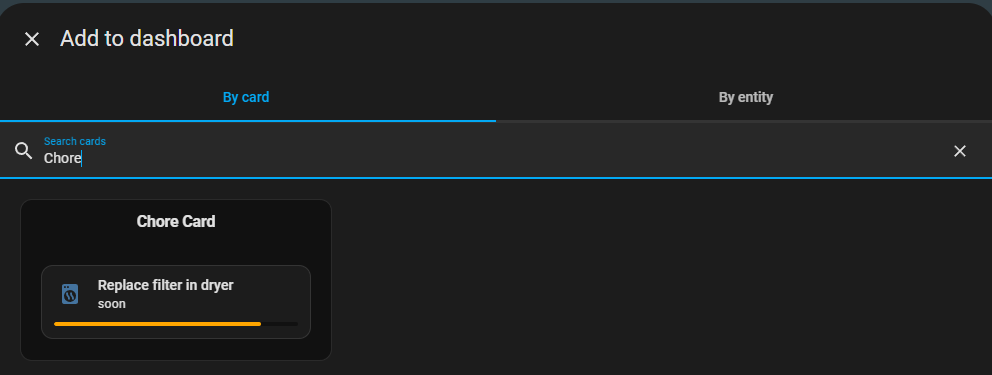

# 🧼 Chore Helper Card

A custom Lovelace card for Home Assistant that visually represents the progress of your chores managed by the [Chore Helper integration](https://github.com/vhonchar/ha-chore). This card provides an intuitive progress bar for each chore, enhancing your dashboard's usability.

> [!IMPORTANT]
> This is an optional companion extension for [ha-chore](https://github.com/vhonchar/ha-chore) custom integration. Please install that integration first.

---

## 💡 Features

- 🧩 Custom chore card for Lovelace UI with a small progress bar
- 📋 Chore-specific enhancements for the [Tile card](https://www.home-assistant.io/dashboards/tile/)
- ⚙️ No YAML needed — configure everything through the UI

---

## 📦 Installation

### ✅ Via [HACS](http://homeassistant.local:8123/hacs) (Recommended)

1. Navigate to **[HACS](http://homeassistant.local:8123/hacs) > ⋮ > Custom repositories**
2. Add this repository:

   1. URL: `https://github.com/vhonchar/ha-chore-card`
   2. Type: **Dashboard**

3. Click Add
4. Install the **Chore Helper Card** from list of available repos

### 🛠️ Manual Installation

1. Download `chore-card.js` file from the [latest release](https://github.com/vhonchar/ha-chore-card/releases)
2. Copy downloaded file into your Home Assistant's `www/` directory
3. Go to **Settings > Dashboards > ⋮ > Resources**
4. Add a new resource
   - URL: `/local/chore-card.js`
   - Type: **JavaScript module**

---

## ⚙️ Configuration

After installation, you can add the card to your dashboard via UI:

---

## 🔧 Troubleshooting

- Ensure both the [ha-chore](https://github.com/vhonchar/ha-chore) integration and this card are installed correctly
- Clear your browser cache if the card doesn't appear as expected
- Check the browser console for any errors related to the card

---

**Made with ❤️ for the Home Assistant community**
